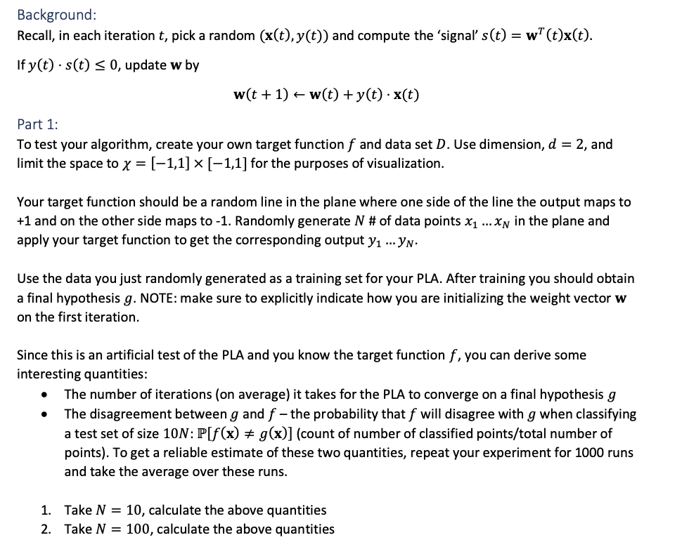
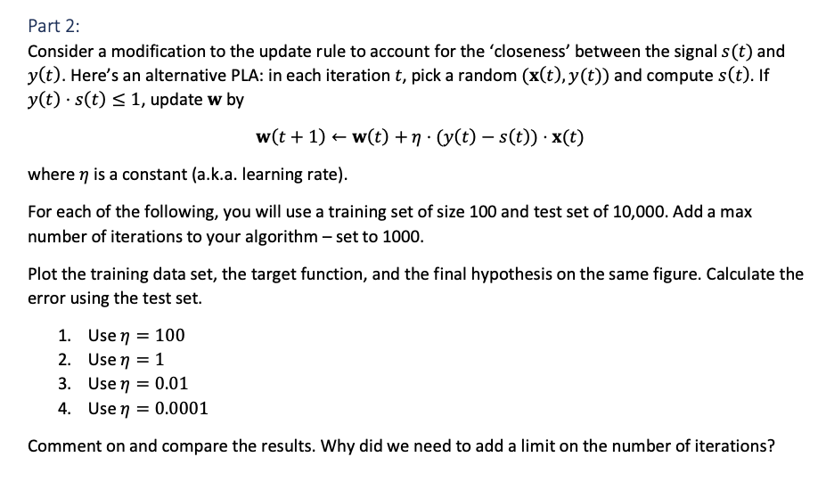
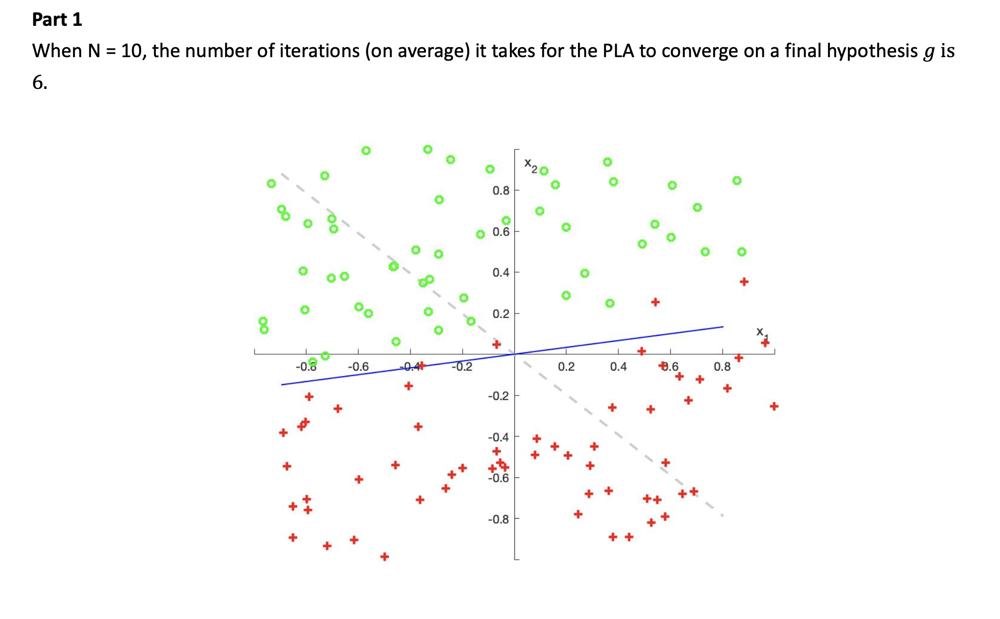
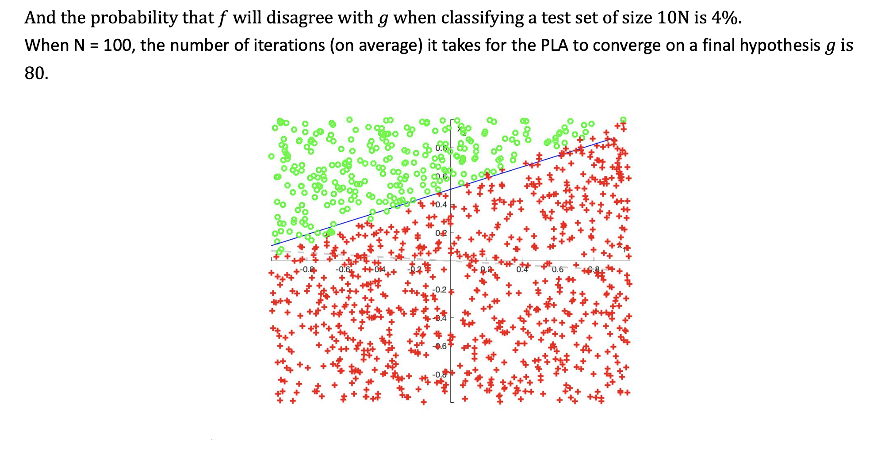
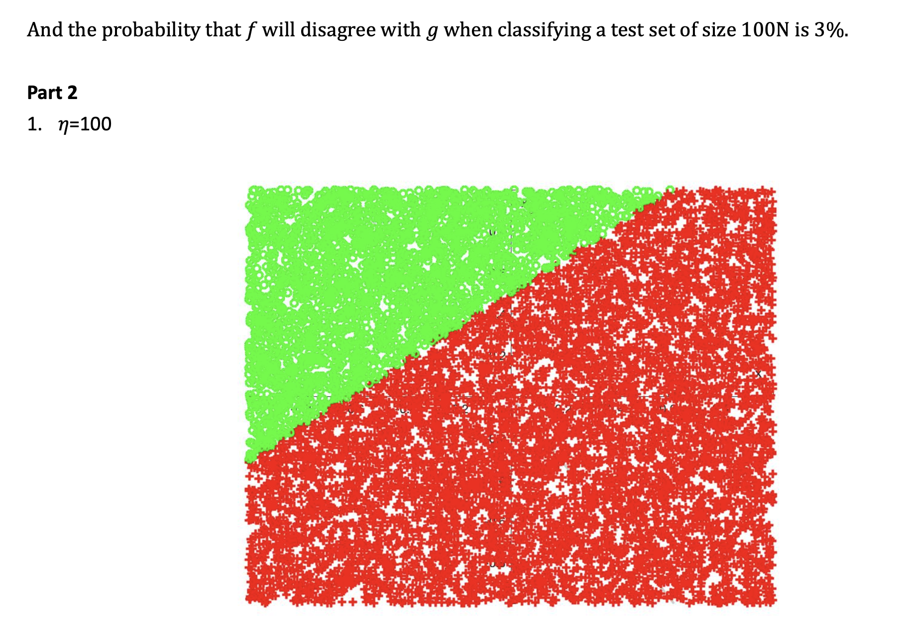
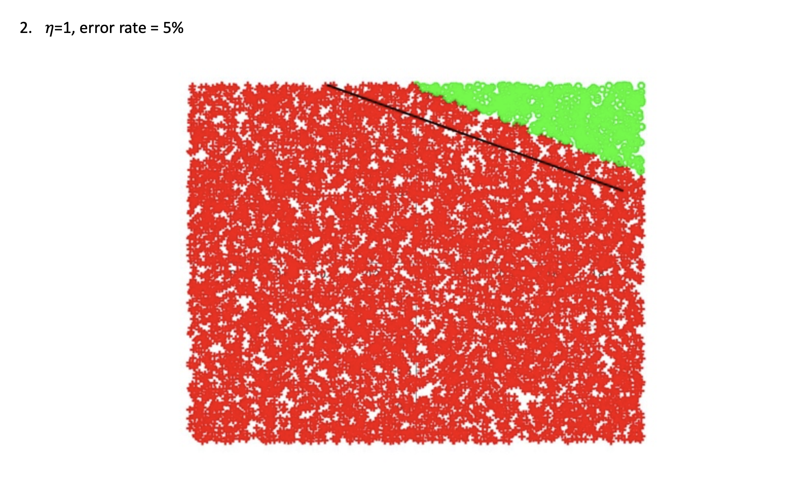
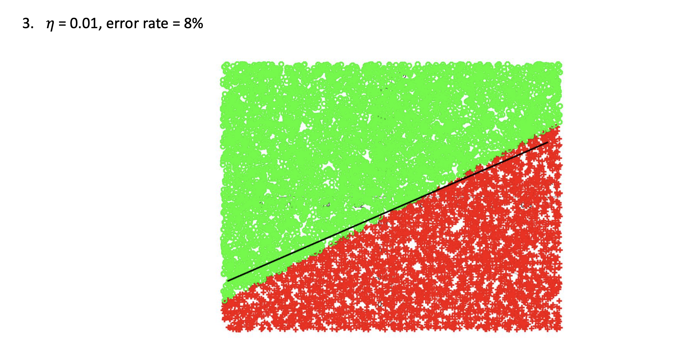
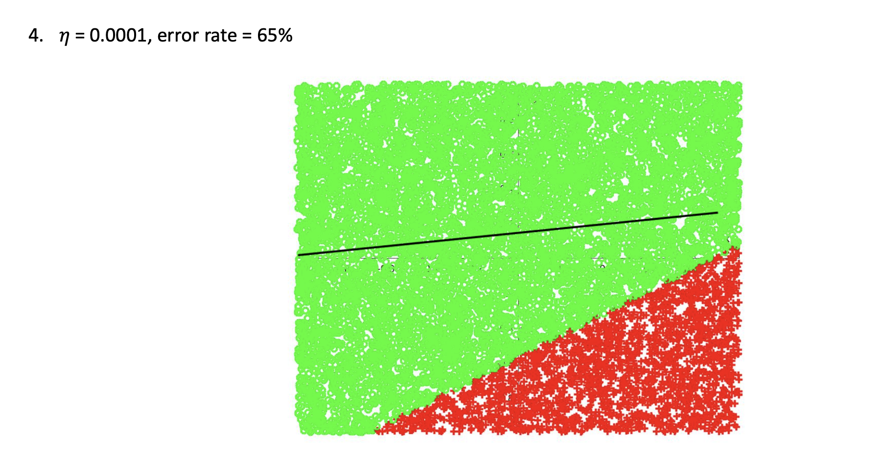

#  The perceptron learning algorithm

### General Task
Implementation of the perceptron learning algorithm by using MATLAB




### Implementation

```
%% part1
for p=1:2

    if p==1
        %first time: 10 points training set and 100 points test set
        N=[10,100];
    else 
        %second time: 100 points training set and 1000 points test set
        N=[100,1000];
    end

    %target function
    targetFLine = 2*rand(1,2)-1;
    
    
    figure(p);

    %generate the data set and plot data points
    for i=1:2
        [X,Y]=generate(N(i),targetFLine);
   
    
        n = size(X,1);
        hold on;
    
        for j = 1:n
            if Y(j) == 1
                scatter(X(j,2),X(j,3),'r','+','LineWidth',2);
            else
                scatter(X(j,2),X(j,3),'g','o','LineWidth',2);
            end
        end    
    
    
    axis([-1 1 -1 1]);
    xlabel('x_1'); ylabel('x_2');
    ax = gca;
    ax.XAxisLocation = 'origin';
    ax.YAxisLocation = 'origin';
    
    count=0;

            %find the G line
        if i==1
            W = -1 +2*rand(3,1);
            W(1,:) = 0;

            xl = min(X(:,2)):0.1:max(X(:,2));
            yl = -(W(2)*xl+W(1))/W(3);

            % plot initial hypothesis line
            plot(xl,yl,'Color',[.8 .8 .8],'LineStyle','--','LineWidth',2);
            y_hyp = zeros(n,1);
         %   
          for m = 1:n
            y_hyp(m) = sign(dot((W),X(m,:)));
          end

          for l = 1:10*n
            if all(y_hyp(:) == Y(:))
                plot(xl,yl,'color','blue','linewidth',1);
                break
            else
                v=find(y_hyp~=Y);
                W=W+Y(v(1))*X(v(1),:)';
                yl = -(W(2)*xl+W(1))/W(3);
            for o = 1:n
                y_hyp(o) = sign(dot((W),X(o,:)));
            end
            end
           
          end
        
        else
            y_hyp_test = zeros(n,1);
            for k = 1:n
                y_hyp_test(k) = sign(dot((W),X(k,:)));
                if Y(k) ~= y_hyp_test(k)
                    count= count+1;
                end
         
            end
        end
    end

    fprintf('In %d points test set, \n the number of error points is %d \n',n,count);
end

```

```
%% part 2
clc; clear;

       
    N=[100,10000];
    

    %target function
    targetFLine = 2*rand(1,2)-1;
    
 
    %generate the data set and plot data points
    for i=1:2
        [X,Y]=generate(N(i),targetFLine);
   
    
        n = size(X,1);
        hold on;
    
        for j = 1:n
            if Y(j) == 1
                scatter(X(j,2),X(j,3),'r','+','LineWidth',2);
            else
                scatter(X(j,2),X(j,3),'g','o','LineWidth',2);
            end
        end    
    
    
    axis([-1 1 -1 1]);
    xlabel('x_1'); ylabel('x_2');
    ax = gca;
    ax.XAxisLocation = 'origin';
    ax.YAxisLocation = 'origin';
    
    count=0;

            %find the G line
        if i==1
            W = -1 +2*rand(1,3);
            W(:,1) = 0;

            xl = min(X(:,2)):0.1:max(X(:,2));
            yl = -(W(2)*xl+W(1))/W(3);

            % plot initial hypothesis line
            plot(xl,yl,'Color',[.8 .8 .8],'LineStyle','--','LineWidth',2);
            y_hyp = zeros(n,1);
         %   
         
          for l = 1:1000
              k = randi([1,100],1,1);
              
              
            if Y(k)*dot((W),X(k,:))<=1
                t=X(k,:);
                W=W+100*(Y(k)-dot((W),X(k,:)))*t;
                
            
           end
          end
        
           yl = -(W(2)*xl+W(1))/W(3);
           %plot(xl,yl,'color','blue','linewidth',1);

        else
            y_hyp_test = zeros(n,1);
            for k = 1:n
                y_hyp_test(k) = sign(dot((W),X(k,:)));
                if Y(k) ~= y_hyp_test(k)
                    count= count+1;
                end
         
            end
        end
        
    end
    
    plot(xl,yl,'color','black','linewidth',2);
    fprintf('In %d points test set, \n the number of error points is %d \n',n,count);
```


### Result








### Comparing and Conclusion:

With the modification, due to 𝑦(𝑡) ⋅ 𝑠(𝑡) ≤ 1, when my learning rate was 1000, each point we pick up in random will agree with this situation. It was pretty hard for it to find the line we want. So, we need to limit the number of iterations. If we didn’t give a limitation, the comparing will keep going. In addition, the learning rate will affect the result. According to my result, the best learning rate which has higher accuracy is 1. The error rate was only 5%. And with the learning rate 0.01, the error rate was up to 8%. Moreover, with the learning rate 0.0001, it was hard to find the right classification line in 1000 iteration. After 1000 iteration, error rate was still up to 65%. In conclusion, with the modification, learning rate should not too large. My recommendation of learning rate is between 0.01~1.