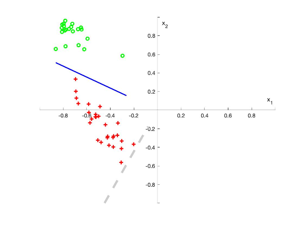
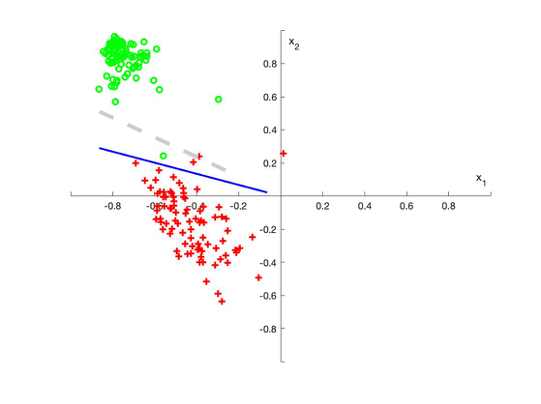

# Pocket Algorithm

### Introduction

In this assignment, we use a portion of a real data set: the USPS Handwritten Digit database. This database comprises of 1100 examples of the digits 0-9. Each example is an 8-bit gray-scale 16px X 16px image. For the purposes of classification, we will simplify this problem by extracting 2 features from each example. The reason to apply pocket algorithm is the data which is not linearly separable meaning there will always be a misclassified training example if we insist on using a linear hypothesis, and hence PLA will never terminate. Essentially, the pocket algorithm keeps 'in its pocket' the best weight vector encountered up to iteration t in PLA. At the end, the best weight vector will be reported as the final hypothesis. The original PLA only checks some of the examples using w(t) to identify (x(t) , y (t) ) in each iteration, while the pocket algorithm needs an additional step that evaluates all examples using w(t + 1) to get Ein(w(t + 1)). 

### The average of error in and out of sample:

***With N = 50,***
 
the average of error in of sample is: 5
 
the average of error out of sample is: 17
 
***With N = 200,***
 
the average of error in of sample is: 6
 
the average of error out of sample is: 19

### Example graphs of algorithm's results with the in-sample data:

N = 50:

N = 200:

### Explanation of your choice of stopping criteria (i.e. fixed number of iterations, etc.).
According to the output, when training set with N = 50 (training points), the average (in 1000 times) of the number of iterations is 5. And, the training set with N= 200, the average of the number of iterations is 6. So, for making the balance between speed and accuracy, I found that 300 times to testing weight can decreased the error out of sample to around 19. 

### The difference or changes were necessary when the training set was set to N=50 and N=200?
According to my output, the iteration of the training set N=50 and N=200 are almost same, but in the error of in and out sample, N = 200 set had higher error value. So, for N=200, the test time should be increase to get more accurate line.
