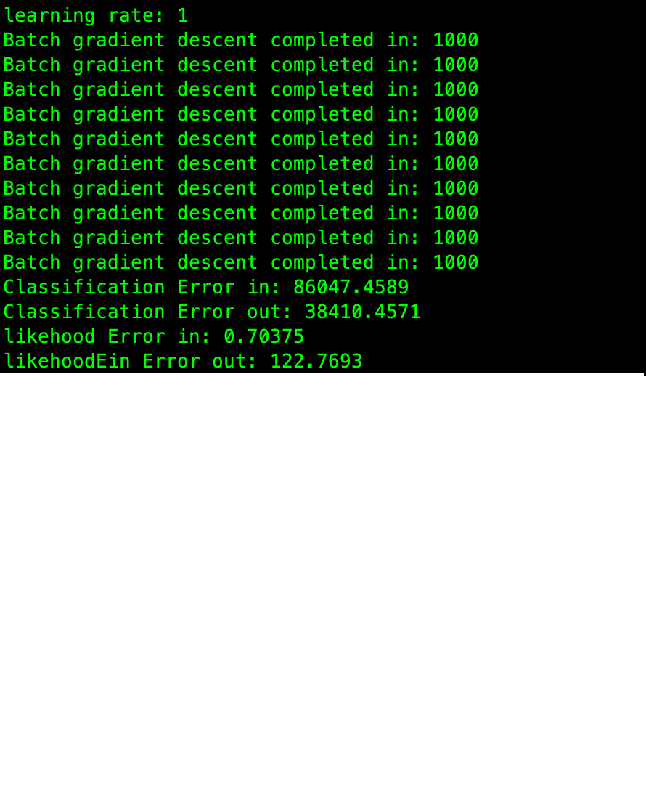

# Logistic Regression

***A.	Logistic Regression with Batch Gradient Descent***

1.	Errors in sample and out sample

With learning rate: 0.1 Classification error: 
in sample: 12 
Out sample: 9 

Likelihood error: 
in sample: 0.1 
Out sample: 1.68 

The number of the classification error in sample greater than out of sample because the training set was 4000 points, and the test set was only 1000. The size of the dataset will affect the value of error. 

when the learning rate, which is greater than 1, the iteration enhances. And the error also increases. In conclusion, the best learning rate is 0.1.

2.	Stopping criteria 
The stopping criteria of batch gradient is that, when the error has not changed significantly in the last 60 times, the loop will be ended. In addition, for avoiding the endless loop, when iteration is greater than 1000 times, the loop will stop.
 
3.	Learning rate 
When the learning rate greater than one, the number of the iteration will increase. it causes higher error, and unpredictable result. The following figure is the batch gradient with learning rate 0.1. 

***B.	Logistic Regression with Stochastic Gradient Descent***

1.	Errors in sample and out sample

With learning rate: 0.1 Classification error:  
in sample: 0.631 
Out sample: 0.6983 

Likelihood error: 
in sample: 0.745 
Out sample: 0.77522 

With learning rate:10 Classification error:  
in sample: 17 
Out sample: 0.4 

Likelihood error: 
in sample: 0.72 
Out sample: 0.43 

With learning rate:50 Classification error:  
in sample: 457 
Out sample: 8.7 

Likelihood error: 
in sample: 3.0 
Out sample: 0.452 

2.	Stopping criteria 
	
	I chose when the gradient is small enough, or it has not changed significantly in the last several times

3.	Learning rate

	Comparing with batch gradient descent, with learning rate which are 0.1, 1, 10, the results of the error are still acceptable. The following are the figures with different learning rates. 

It shows that with the learning rate 50, the gradient was moving too far that makes harder to fine the correct line.

