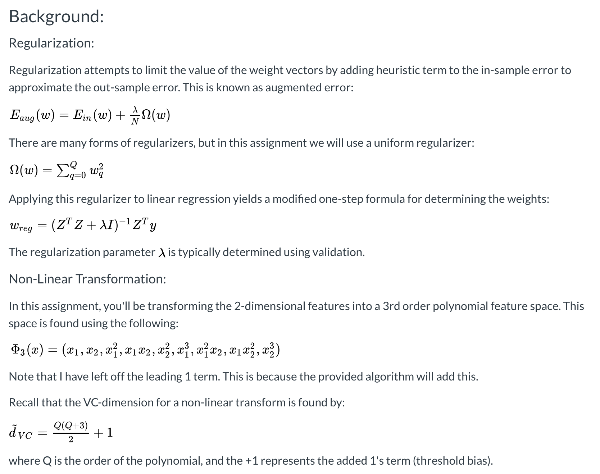
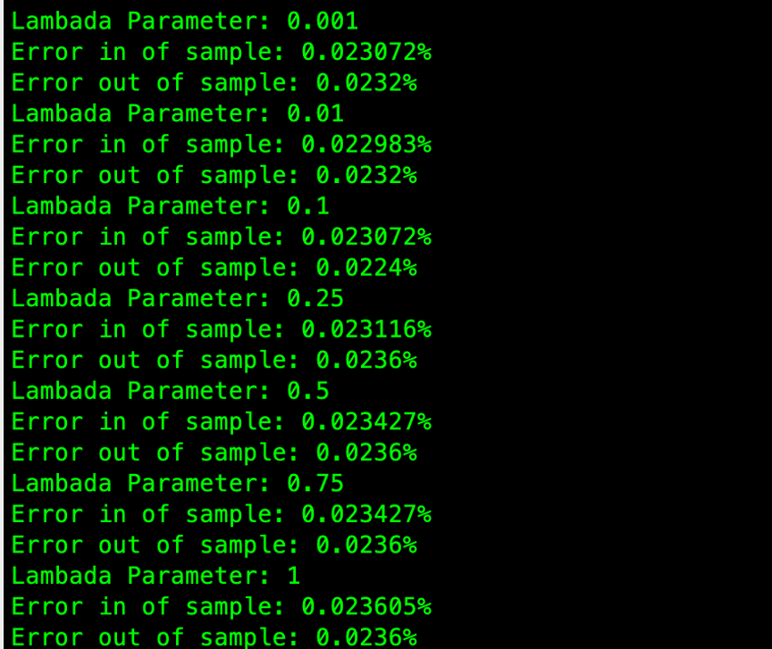
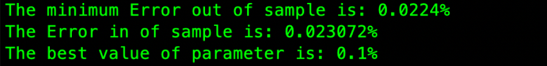
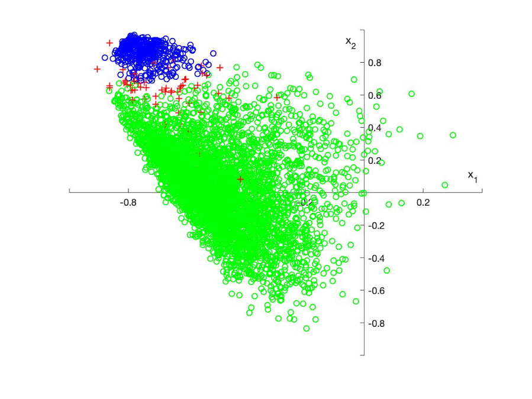

# Regularization and Validation

In this project you will again be using the USPS Handwritten digit dataset: usps_modified.mat. Test your algorithms using the dataset to separate (classify) digit 1 from all other digits.

***General Tasks:***

* Use the provided linear regression algorithm: linreg.mPreview the document
* Create a code function (a separate file) to perform a non-linear transform of the symmetry and intensity features to a 3rd order polynomial set.
* Using 10-fold cross validation, test values of lambda (the regularization parameter): , 0.001, 0.01, 0.1, 0.25, 0.5, 0.75, 1. Use the validation results to find the best value of lambda.
* Tabulate the average weight vector from each cross-validation test of each value for lambda. Comment on how the regularizer is affecting the weights for the various polynomial terms.

***A.	Comparison of errors 'in-sample' and 'out-sample' for each value of lambda (0.001, 0.01, 0.1, 0.25, 0.5, 0.75, 1):***

***B.	 Choice of best value of lambda:***

***C.	Discuss effect of lambda on the non-linear transform weights***

When lambda is decreasing, the risk of overfitting is increasing. when the lambda is increasing, the chance of underfitting happen is increasing. underfitting occurs when lambda is too large, because the learning algorithm has too little flexibility to fit the data. So, according to the results I have gotten, when the value of lambda which is between 0.001~0.1 is the best choice for regulation. In addition, as you decrease the optimization pays less attention to the penalty term and more to Ein, and so Ein will decrease

***D.	Plot of final classification curve using best lambda and corresponding average weight vector:***

Blue represent the digit 1, and green represent the digit from 0 to 9 without 1. Red represent the points which is misclassified. In this case, the best lambda is 0.1 and I took average of weight vector to find classification of data points. 

