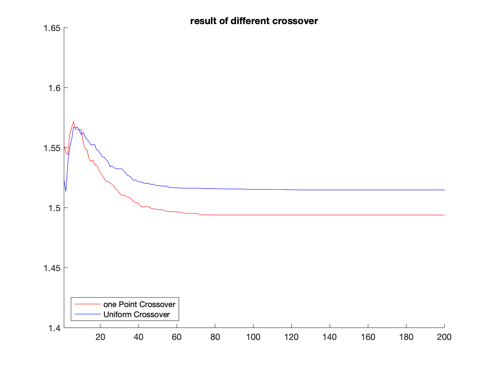

# Genetic Algorithm Crossover Comparison

**Problem Statement:**</br>
Use a genetic algorithm to find the global optimum of the following objective function:


`objf = @(x,y) exp(-((x-3).^2+(y-3).^2)./5) + 0.8.*exp(-(x.^2+(y+3).^2)./5) + 0.2*(cos(x.*pi./2)+cos(y.*pi./2)) + 0.5;
`

Mathematically we know this function has a maximum height of 1.6903 in the range of -5 to 5 for x and y.

```
[x,y]=meshgrid(-5:0.05:5);
mesh(x,y,objf(x,y));
```


**Methods:**
	
* Representation: Binary
* Selection: Elitist, Rank Selection
* Mating/Variation: Single Point Binary Crossover, Uniform Crossover

**Initialize Parameters**

For a genetic algorithm, the important parameters are population size, number of generations to execute, fraction of population seleected for mating, the data representation, and the range of data.

```
clc;
clear;
    % ***** User Changable Variables ***** %
objf = @(x,y) exp(-((x-3).^2+(y-3).^2)./5) + 0.8.*exp(-(x.^2+(y+3).^2)./5) + 0.2*(cos(x.*pi./2)+cos(y.*pi./2)) + 0.5;

pop = 40;               %population size
gen = 200;              %number of generations
pcntsel = 0.5;          %fraction of candidated selected for next generation

precision = 8;          %precision of real number represenation (ex. 8 -> 8-bit represenation)
range = [-5 5; -5 5];   %bounds for input variables

% ***** Calculations ***** %
mu = round(pcntsel*pop);    %number of parents selected
lambda = pop - mu;    %number of new candidates in each generation (children)
figure;
hold on;
axis([1 200 1.4 1.65]);
```

***Generate Initial Population and Genetic Algorithm***

Generally, the initial population is generated randomly within specified ranges. 

```
for C = 1:2
	 plotarray = zeros(200,1);
    for t = 1:200
        candidate.binx = rand(pop,precision)>0.5;   %generate binary representation
        candidate.biny = rand(pop,precision)>0.5;
        
        bestGenArray = zeros(200,1);
        
        for i = 1:gen
    
        % ********* Convert Representation ****** %
            candidate.x = (range(1,1)-range(1,2))*(bi2de(candidate.binx)/(2^precision-1))+range(1,2);
            candidate.y = (range(2,1)-range(2,2))*(bi2de(candidate.biny)/(2^precision-1))+range(2,2);
        % *************************************** %
    
        % ********* Get Fitness ***************** %
            candidate.fit = objf(candidate.x,candidate.y);
        % *************************************** %
    
        % ********* Selection ******************* %
            %Linear (Roulette Wheel) Selection
            fitsum = sum(candidate.fit);
            [cfit, I]= sort(candidate.fit);
            
            
            %the best value for each generation
            bestGenArray(i) = candidate.fit(I(pop,:),:);
            
            candidate.p = cfit./fitsum;
            [m,n] = size(candidate.p);
            candidate.sp = cumsum(candidate.p);
            
            %[candidate, bestGenArray] = prop_selection(bestGenArray,candidate, mu, i)
          
        
          
          %Selection
            for j = 1:mu
                sel=rand;
                for k = 1:pop
                    if candidate.sp(k) >= sel
                        newCandidate.binx(j,:) = candidate.binx(I(k),:);
                        newCandidate.biny(j,:) = candidate.biny(I(k),:);
                    break;
                    end
                end
            end
    
   
   
        % *************************************** %
    
        % ********* Create Offspring ************ %
            
        if C == 1
            [newCandidate] = onePointCrossover(newCandidate, mu, precision, lambda);
            %T = ('Graph of one point crossover');
        else
            [newCandidate] = uniformCrossover(newCandidate, mu, precision, lambda);
            %T = ('Graph of uniform crossover');

        end
        % *************************************** %
    
        % ********* Next Generation ************* %
            candidate = newCandidate;
        % *************************************** %
        end
        plotarray = plotarray + bestGenArray;

    end
    plotarray = plotarray./t;
    
    if C == 1
        plotarrayA = plotarray;
    end
    
end


title("result of different crossover");
xlabel = ('generation')
ylabel = ('fitness function')

a = 1:200;
d = 1:200;
   
b = plotarray(a);
c = plotarrayA(d);

plot(a,b,'color','r');
plot(d,c,'Color','b');

legend({'one Point Crossover','Uniform Crossover'},'Location','southwest')


hold off;
xlabel = 'generation'
ylabel = 'fitness function'
```


```
function [newCandidate] = uniformCrossover(newCandidate, mu, precision, lambda)
% implement the uniform crossover algorithm.
        Child1x = zeros(1,precision);
        Child2x = zeros(1,precision);
        Child1y = zeros(1,precision);
        Child2y = zeros(1,precision);
        i = 1;
    while i <= lambda
        
        %binary mask
        mask = randi([0 1], 1, precision); 
        
        % choose two parents in random
        ParentIndex1 = 0;
        ParentIndex2 = 0;
        
        %pick up the parent in random
        while ParentIndex1 == ParentIndex2
            ParentIndex1 = randi([1 mu], 1, 1);
            ParentIndex2 = randi([1 mu], 1, 1);
        end
        
        
        Parent1x = newCandidate.binx(ParentIndex1,:);
        Parent1y = newCandidate.biny(ParentIndex1,:);

        Parent2x = newCandidate.binx(ParentIndex2,:);
        Parent2y = newCandidate.biny(ParentIndex2,:);
        
       
        for j = 1 : precision
            if mask (j) == 1
                Child1x(j) = Parent1x(j);
                Child1y(j) = Parent1y(j);
                Child2x(j) = Parent2x(j);
                Child2y(j) = Parent2y(j); 
            else
                Child1x(j) = Parent2x(j);
                Child1y(j) = Parent2y(j);
                Child2x(j) = Parent1x(j);
                Child2y(j) = Parent1y(j); 
            end
        
        
        end
        newCandidate.binx(mu+i,:) = Child1x(1,:);
        newCandidate.biny(mu+i,:) = Child1y(1,:);
        i = i+1;
        newCandidate.binx(mu+i,:) = Child2x(1,:);
        newCandidate.biny(mu+i,:) = Child2y(1,:);
        i = i+1;
    end
        
   

end

function [newCandidate] = onePointCrossover(newCandidate, mu, precision, lambda)
   
        i = 1;
    while i <= lambda
        ParentIndex1 = 0;
        ParentIndex2 = 0;
        crosspoint1 = randi([1 precision], 1, 1); %the cross point
        crosspoint2 = randi([1 precision], 1, 1);
        %pick up the parent in random
        
     
        
        while ParentIndex1 == ParentIndex2 
            ParentIndex1 = randi([1 mu], 1, 1);
            ParentIndex2 = randi([1 mu], 1, 1);
        end
        
        
        Parent1x = newCandidate.binx(ParentIndex1,:);
        Parent1y = newCandidate.biny(ParentIndex1,:);

        Parent2x = newCandidate.binx(ParentIndex2,:);
        Parent2y = newCandidate.biny(ParentIndex2,:);
      
        
        newCandidate.binx(mu+i,:) = [Parent1x(1:crosspoint1),Parent2x(crosspoint1+1:precision)];
        newCandidate.biny(mu+i,:) = [Parent1y(1:crosspoint2),Parent2y(crosspoint2+1:precision)];
        i = i+1;
        newCandidate.binx(mu+i,:) = [Parent2x(1:crosspoint1),Parent1x(crosspoint1+1:precision)];
        newCandidate.biny(mu+i,:) = [Parent2y(1:crosspoint2),Parent1y(crosspoint2+1:precision)]; 
        i = i+1;
        
        
    end
        
end

```

***Results and Conclusions***

A point on both parents' chromosomes is picked randomly, and designated a 'crossover point'. Bits to the right of that point are swapped between the two parent chromosomes. This results in two offspring, each carrying some genetic information from both parents. In the uniform crossover, typically, each bit is chosen from either parent with equal probability. Other mixing ratios are sometimes used, resulting in offspring which inherit more genetic information from one parent than the other. As we can see, the plots appear that uniform cross over algorithm got a stable value with less generation than one point cross over algorithm. In this case, these two algorithms have different random parents, so, we don’t discuss which algorithm can get higher value at the end. In addition, by comparing the curves of figures, the curve of one point cross over algorithm seems that it has more dramatic fluctuations. And, the curve of uniform cross over algorithm seems more smooth. 
In conclusion, the uniform cross over algorithm is more efficient in this case.
