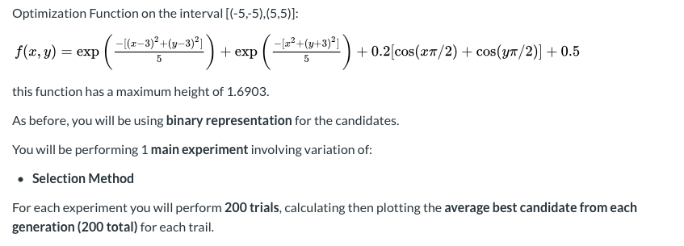
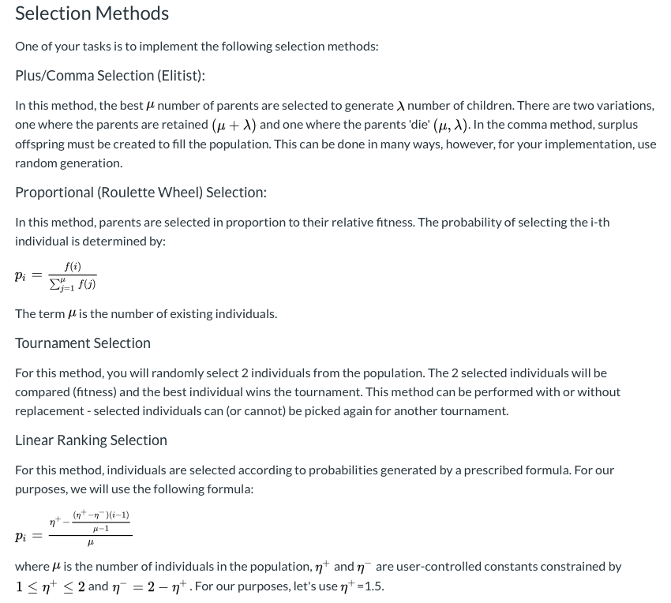
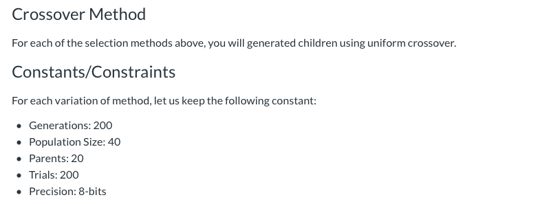
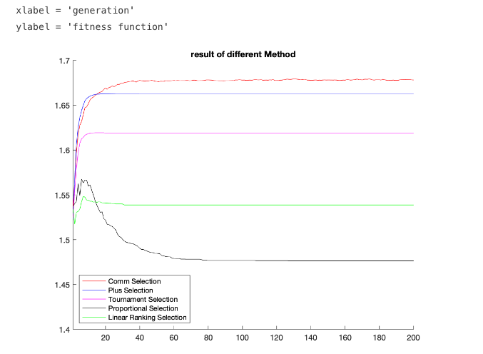

# Evolutionary Algorithm Experiments with Selection

***General Task:***




	


**Initialize Parameters**

For a genetic algorithm, the important parameters are population size, number of generations to execute, fraction of population seleected for mating, the data representation, and the range of data.

```
clc;
clear;
    % ***** User Changable Variables ***** %
objf = @(x,y) exp(-((x-3).^2+(y-3).^2)./5) + 0.8.*exp(-(x.^2+(y+3).^2)./5) + 0.2*(cos(x.*pi./2)+cos(y.*pi./2)) + 0.5;

pop = 40;               %population size
gen = 200;              %number of generations
pcntsel = 0.5;          %fraction of candidated selected for next generation

precision = 8;          %precision of real number represenation (ex. 8 -> 8-bit represenation)
range = [-5 5; -5 5];   %bounds for input variables

% ***** Calculations ***** %
mu = round(pcntsel*pop);    %number of parents selected
lambda = pop - mu;          %number of new candidates in each generation (children)

figure;
hold on;
axis([1 200 1.4 1.7]);
```

***Generate Initial Population and Genetic Algorithm***

Generally, the initial population is generated randomly within specified ranges. 

```
for C = 1:5
    plotarray = zeros(200,1);
    for t = 1:200
        
        candidate.binx = rand(pop,precision)>0.5;   %generate binary representation
        candidate.biny = rand(pop,precision)>0.5;
        
        bestGenArray = zeros(200,1);
        
        for i = 1:gen
    
        % ********* Convert Representation ****** %
            candidate.x = (range(1,1)-range(1,2))*(bi2de(candidate.binx)/(2^precision-1))+range(1,2);
            candidate.y = (range(2,1)-range(2,2))*(bi2de(candidate.biny)/(2^precision-1))+range(2,2);
        % *************************************** %
    
        % ********* Get Fitness ***************** %
            candidate.fit = objf(candidate.x,candidate.y);
        % *************************************** %
    
        % ********* Selection ******************* %
        switch C
            case{1}
                [newCandidate,bestGenArray] = CommSelection(candidate,bestGenArray,mu,i); %parent will die
            case{2}                
                [newCandidate,bestGenArray] = PlusSelection(candidate,bestGenArray,mu,i); %parent will live
            case{3}
                [newCandidate,bestGenArray] = TournamentSelection(candidate,bestGenArray,mu,i,pop);
            case{4}
                [newCandidate, bestGenArray] = ProportionalSelection(candidate,bestGenArray,pop,mu,i);
            case{5}
                [newCandidate,bestGenArray] = LinearRankingSelection(candidate,bestGenArray,pop,mu,i);
        end
        

   
        % *************************************** %
    
        % ********* Create Offspring ************ %
           
        if C == 1 
            [newCandidate] = CrossoverDie(newCandidate, mu, precision, lambda); %only for comm selection 
        else
            [newCandidate] = uniformCrossover(newCandidate, mu, precision, lambda);
        end

      
        % *************************************** %
    
        % ********* Next Generation ************* %
            candidate = newCandidate;
        % *************************************** %
        end
        plotarray = plotarray + bestGenArray;

    end
    plotarray = plotarray./t;
   
    switch C
        case {1}
            plotarrayA = plotarray; 
        case {2}
            plotarrayB = plotarray;
        case {3}
            plotarrayC = plotarray;
        case {4}
            plotarrayD = plotarray;  
        case {5}
            plotarrayE = plotarray;
    end
end

%plot
title("result of different Method");
xlabel = ('generation')
ylabel = ('fitness function')

a = 1:200;
b = 1:200;
c = 1:200;
d = 1:200;
e = 1:200;
   
A = plotarrayA(a);
B = plotarrayB(b);
C = plotarrayC(c);
D = plotarrayD(d);
E = plotarrayE(e);

plot(a,A,'color','r');
plot(b,B,'Color','b');
plot(c,C,'Color','m');
plot(d,D,'Color','k');
plot(e,E,'Color','g');

legend({'Comm Selection','Plus Selection','Tournament Selection','Proportional Selection','Linear Ranking Selection'},'Location','southwest')


hold off;

```



***Results and Conclusions***

   In this implement, I have done five different selections: Linear Ranking, Proportional, Tournament, Plus, Comm. As we can see, in comma selection, parents die after a uniform crossover algorithm and then create the offspring in random that enhances the chance to generate better offspring. On the other hand, without parents die in the plus selection, due to we choose the best top 20 points to be parents, it still benefits to generate better offspring. In this case, the comm selection is better than plus selection. Also, the proportional selection seems the worst selection in this case. It has the chance to abandon the good parents in each generation. Comparing with tournament selection, tournament selection reserved the winner from each tournament that makes an algorithm to remain the good points. For linear ranking selection, the selection probability is linearly assigned to the individuals according to their rank. It gave the result which is fine but not good enough. In conclusion, with or without replacement of parents and mutation will also affect the result of the algorithm. But all of the results are about probability. Sometimes the results will look bad, but sometimes will be good which looks like this result of the plot. We need to give more different method to make sure the algorithm has enough probability to generate better offspring and reserve the good parents. 
