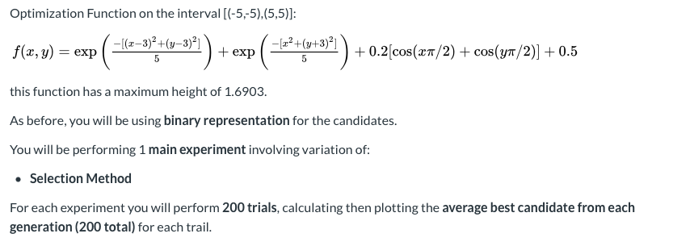
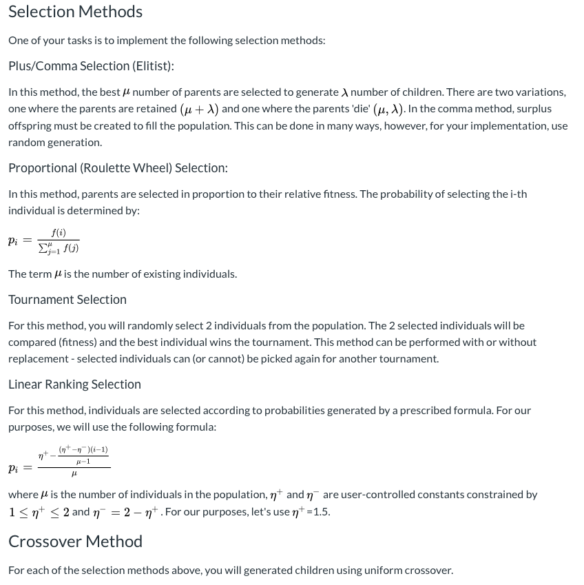
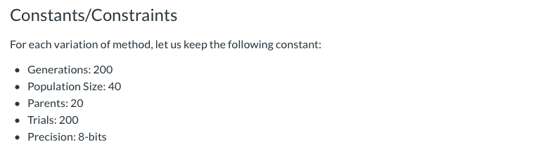
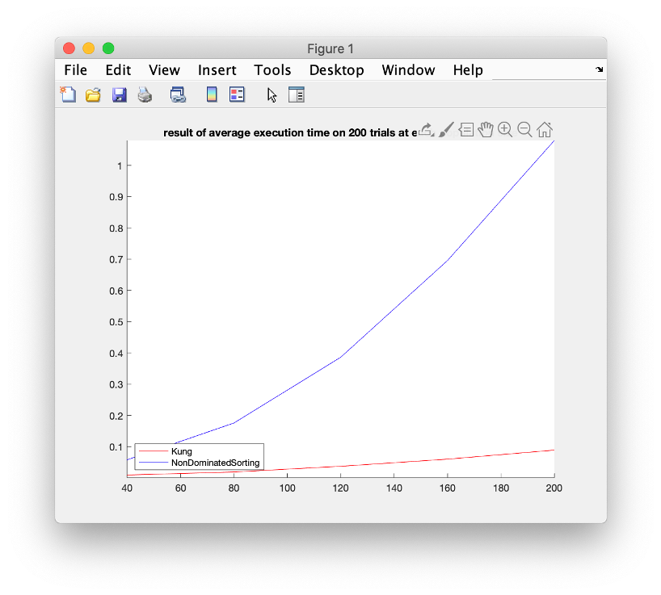
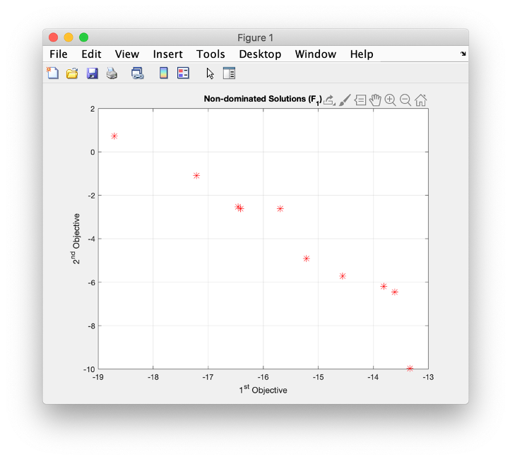

# Evolutionary Algorithm Experiments with Selection

### Introduction:
For this culminating project we will be modifying a major part of a Multi-Objective Evolutionary Algorithm (MOEA). We will be on developing, benchmarking, and comparing the selection and ranking methods often found in MOEAs.

### General Task:

-
### Implementation

***Selection:***

In a MOEA, selection of candidates for the next generation is often based on the concept of dominance. Essentially, does a candidate dominate another candidate in none, one, or both (or more) of the objectives. Solutions who are fully or partially dominant are selected as parents for the next generation. This concept is known as the Pareto front. We will compare two algorithms to determine the Pareto fronts in a set candidate:
A.	Naive implementation - comparisons of all candidates to each other.
B.	Kung's Method - recursive method, based on the concept of balanced binary search trees

***Kung’s algorithm:***

In this algorithm, we should sort the points based on the first objectives. Then we use the recursive function to classify the points in T(top) set and B(bottom) set. Each point from B set will be compared with the points in T. If any objective two of point in B set is less than all objective two of point in T set, it is not dominated by any point in T set, and it will be return to front. On the other hand, if the point in B set is greater than any objective two of point in T set. It will be eliminated. 

***Benchmarking:***

In the naive implementation the computational complexity is O(dn^2) for any dimension. When d = 2, Kung's method has complexity O(n log(n)). However, in many MOEAs several other parameters must be calculated and often times the secondary, tertiary, etc. fronts must also be found. Specifically, we focus on finding the front using Kung's algorithm versus the naive method. In order to understand the performance differences, we need to test the algorithms at different scales - let's vary the size of the population from 40 candidates to 200 candidates in 40 candidate increments.

***Result of time measure and conclusion:***

As we can see, in figure 1, execution time of non-dominated sorting is slower than the Kung’s method. In addition, figure 2 is showing the distribution of points we found in front one. The time complexity of kung’s algorithm is O(n log(n)). Comparing with the computational complexity of original one which is n^2, Kung’s method has better efficiency of computation. It is due to the recursion. Recursion helps kung’s can be faster to find the front one points. 

