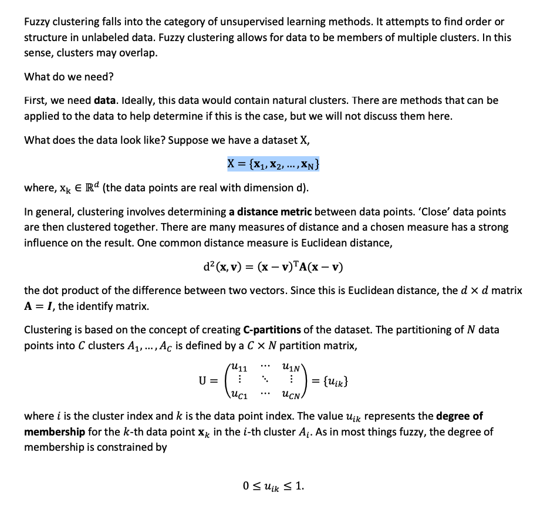
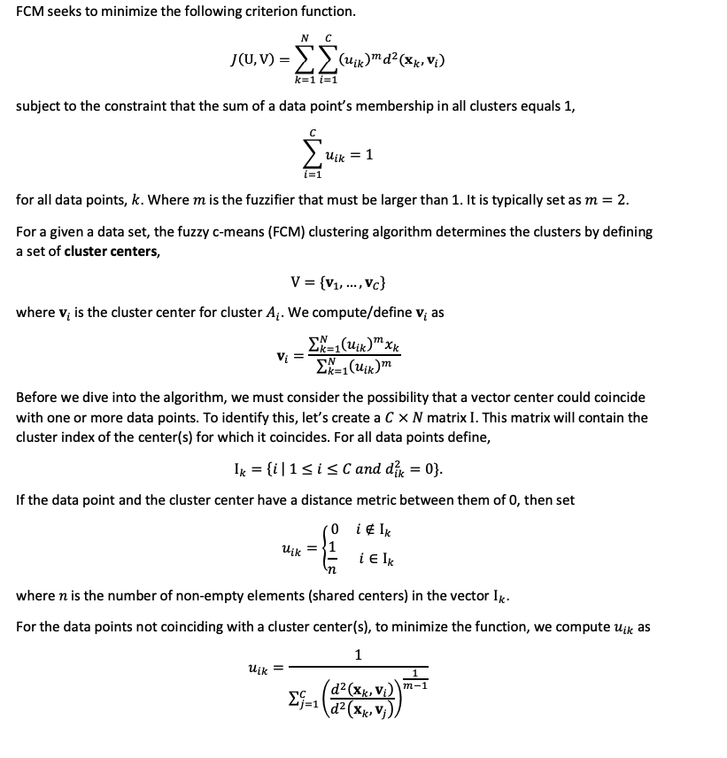
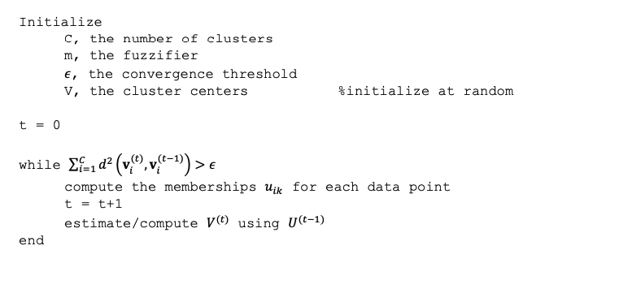
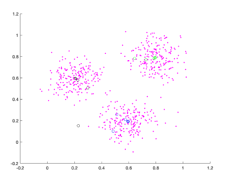

# Fuzzy Clustering

### Introduction



### Fuzzy C-Means



### Fuzzy C-Mean Algorithm




### Implementation

```
%% main.m
clc;
clear;
close all;  
load("clusterdata.mat");
[n, ~] = size(clusterdemo);
%%


%% plot the data points

figure;
hold on;
scatter3(clusterdemo(:,1),clusterdemo(:,2),clusterdemo(:,3),'magenta','.');
%%


%%Initialize 
c = 3; %number of clustering
m = 2; %fuzzifier
Epsilon = 0.00001; % convergence threshold
% randomize first cluster centers
V = rand(3);
Vnew = V;
%iteration
t = 0;
%uij array
u = zeros(600,3);
% check the changes    
change  = 0.1;
%%


%% Fuzzy algorithm

while change > Epsilon
    
    %print the central points for each iteration
    scatter3(Vnew(1,1),Vnew(1,2),Vnew(1,3),'black','o');
    scatter3(Vnew(2,1),Vnew(2,2),Vnew(2,3),'green','o');
    scatter3(Vnew(3,1),Vnew(3,2),Vnew(3,3),'blue','o');
   
    
    V = Vnew;
    
    %cal the u martix
    for k = 1:n
        dtotal = 0;
        %cal Vj
        for j = 1:c
            d = norm((clusterdemo(k,:)-V(j,:)));
            u(k,j) =d;
        end
       
        %cal each clustering 
        u(k,:) = 1./u(k,:);
        u(k,:) = (u(k,:)).^2;

        disInTotal = sum(u(k,:));%sum of distance
        
        % cal membership for each cluster
        u(k,:) = u(k,:)/disInTotal;
          
    end 
%%   

    
    
    %%cal new central
    
    for i = 1:c  
        numerator = 0;
        denominator = 0;
            
        for k = 1:n   
            
            numerator = (u(k,i)^2).*clusterdemo(k,:)+numerator;    
            denominator = u(k,i)^2 + denominator;
            
        end
            
            Vnew(i,:) = numerator/denominator;
       
    end
    
    %%
    
    
    t = t + 1;
    change = 0;
    disp("iteration :" + t);
    
    %% cal the changes
    for j = 1:c
        d = norm((Vnew(j,:)-V(j,:)));
        change = d + change;
    end
   %% 
end
%%    

```


```
%Fuzzy algorithm 
%by Marco Lin

%%
clc;
clear;
close all;  
load("clusterdata.mat");
[n, ~] = size(clusterdemo);
%%


%% plot the data points

figure;
hold on;
scatter3(clusterdemo(:,1),clusterdemo(:,2),clusterdemo(:,3),'magenta','.');
%%


%%Initialize 
c = 3; %number of clustering
m = 2; %fuzzifier
Epsilon = 0.00001; % convergence threshold
% randomize first cluster centers
V = rand(3);
Vnew = V;
%iteration
t = 0;
%uij array
u = zeros(600,3);
% check the changes    
change  = 0.1;
%%


%% Fuzzy algorithm

while change > Epsilon
    
    %print the central points for each iteration
    scatter3(Vnew(1,1),Vnew(1,2),Vnew(1,3),'black','o');
    scatter3(Vnew(2,1),Vnew(2,2),Vnew(2,3),'green','o');
    scatter3(Vnew(3,1),Vnew(3,2),Vnew(3,3),'blue','o');
   
    
    V = Vnew;
    
    %cal the u martix
    for k = 1:n
        dtotal = 0;
        %cal Vj
        for j = 1:c
            d = norm((clusterdemo(k,:)-V(j,:)));
            u(k,j) =d;
        end
        %cal each clustering 
        u(k,:) = 1./u(k,:);
        u(k,:) = (u(k,:)).^2;

        disInTotal = sum(u(k,:));%sum of distance
        
        % cal membership for each cluster
        u(k,:) = u(k,:)/disInTotal;
          
    end 
%%   

    
    
    %%cal new central
    
    for i = 1:c  
        numerator = 0;
        denominator = 0;
            
        for k = 1:n   
            
            numerator = (u(k,i)^2).*clusterdemo(k,:)+numerator;    
            denominator = u(k,i)^2 + denominator;
            
        end
            
            Vnew(i,:) = numerator/denominator;
       
    end
    
    %%
    
    
    t = t + 1;
    change = 0;
    disp("iteration :" + t);
    
    %% cal the changes
    for j = 1:c
        d = norm((Vnew(j,:)-V(j,:)));
        change = d + change;
    end
   %% 
end

%%print out the final central points
scatter3(Vnew(1,1),Vnew(1,2),Vnew(1,3),'black','x');
scatter3(Vnew(2,1),Vnew(2,2),Vnew(2,3),'green','x');
scatter3(Vnew(3,1),Vnew(3,2),Vnew(3,3),'blue','x');
%%

hold off;

```


### Conclusion:
   In Fuzzy C-Means algorithm, it tooks around 9 iteration times to obain the central points. As wee can see, the advantages of the algorithm is that it can give best result for overlapped data set and comparatively better then k-means algorithm. And also, unlike k-means where data point must exclusively belong to one cluster center here data point is assigned membership to each cluster center as a result of which data point may belong to more then one cluster center.
