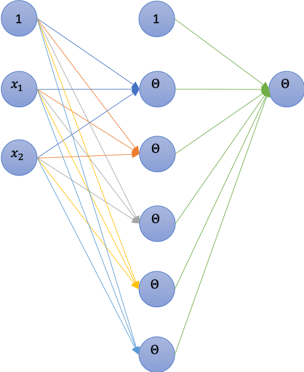
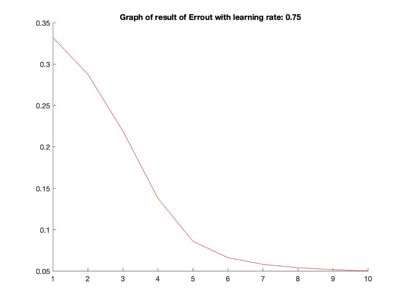
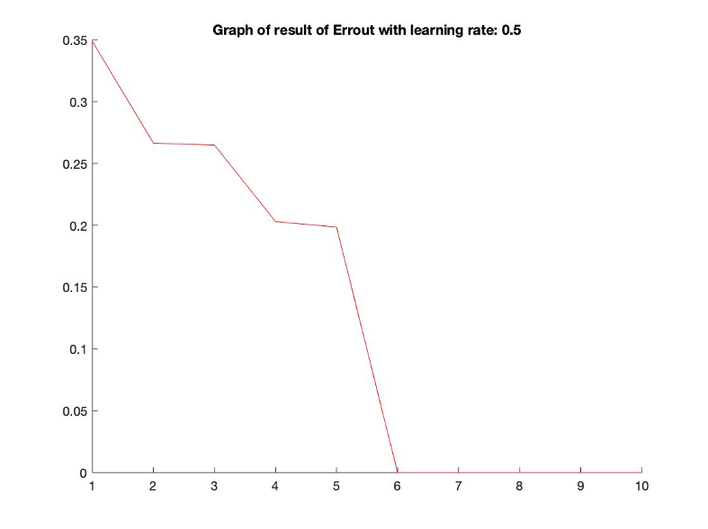
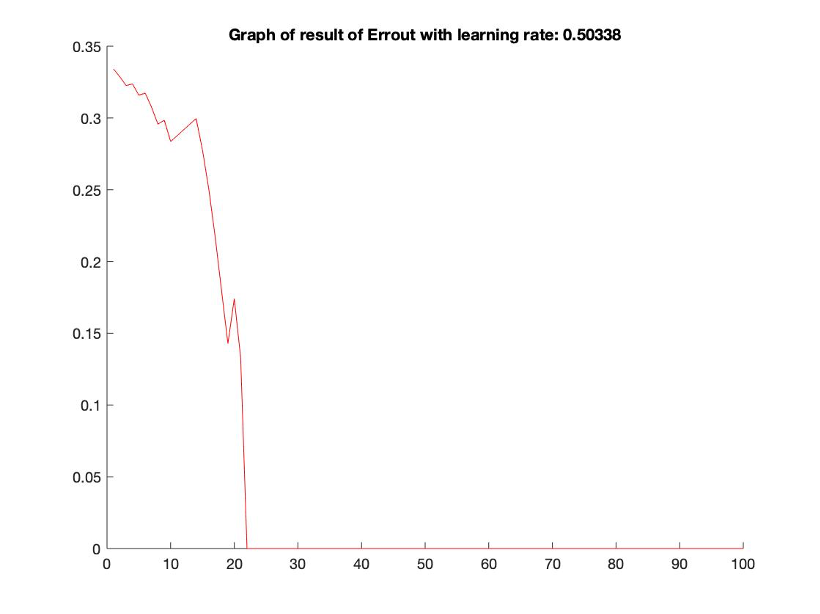
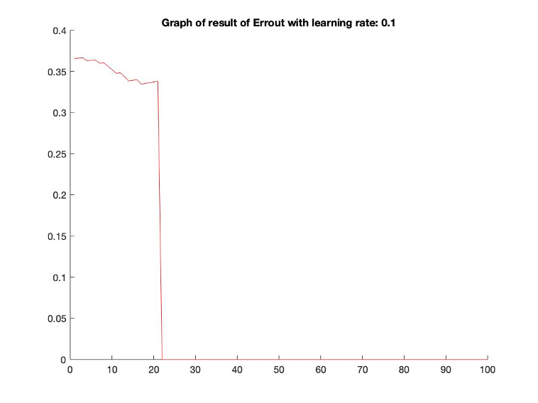
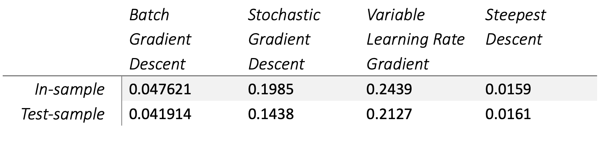
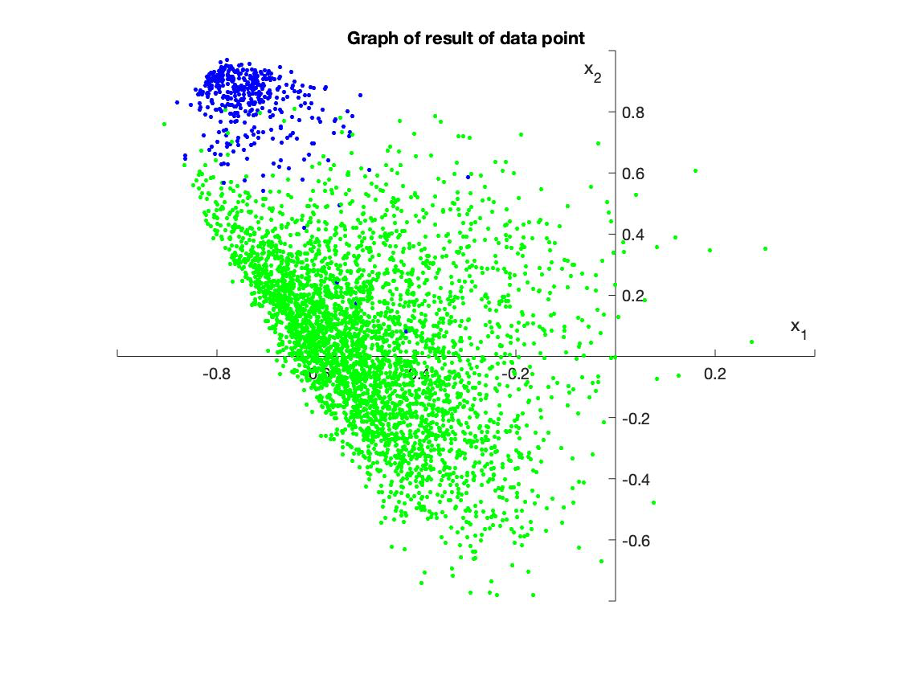

# Neural Network Implementation

In this project you will again be using the USPS Handwritten digit dataset: usps_modified.matView in a new window

### General Task

I will be creating your own simple neural network. You network will have the following properties:

1 Input Layer - For the digits data this will be d = 2.
1 hidden layers with 5 nodes (d = 5)
1 output layer
Single output for classifying the digit 1 from the full dataset.

The stopping criteria should be a combination of low error or small change in error or small gradient, and a hard iteration limit.

***Sub-tasks:***

* Use the Feature Extractor Algorithm for Symmetry and Intensity 
* Build a Forward Propagation Algorithm with error calculation (single data-point)
* Build a Backpropagation Algorithm (single data-point)
* Build a Training Algorithm: runs forward and back-propagation, computes error and gradients, updates weights*. Try to use 10-fold cross validation for parameter selection. Save 20% of the data for step 5.
* Build a Classification/Test Algorithm: takes final (or previous) network weights and classifies a data-point.

***Algorithm have weight update options:***

1. Batch Gradient Descent
2. Stochastic Gradient Descent
3. Variable Learning Rate Gradient Descent
4. Steepest Descent (Gradient Descent with Line Search)

### Implementation

***A. Difficulties***

The first difficulty I got was how to determine the stopping criteria. The stopping criteria will affect the result of the error. For example, the program will keep running, even though the error in the sample and out sample is good enough. So, I have tried to modify the stopping criteria a little bit each time. For example, one of my stopping criteria is that the similarity of an error each time. If the value of error is not changing too much in a range 10 times, the algorithm will stop. So, I checked the curve which is the error in the sample and out sample iteration. So, I found that the changing of error within 0.01 makes us get a good result. 

Also, I was stuck in how to implement the batch gradient descent. Due to the previous assignment, we only implement the gradient descent with logistic regression. We can just train all data points at one time. But, in the neural network, it has several layers, we can train our data points at the same time. So, I followed the direction which is training one data point each iteration. And then I calculated the average of error in sample and gradient for updating the weight.

***B.	Plots of error over iteration for each weight update method:***

The curve represents the tendency of error out of sample over each iteration. 

***i.	Batch Gradient Descent***

***ii.	Stochastic Gradient Descent***

***iii.	Variable Learning Rate Gradient Descent***

***iv.	Steepest Descent (Gradient Descent with Line Search)***

***C. Average of in-sample and test-sample error:***

I have run 50 times to get solid average result for each method.

***D. Map of classification space:***

Blue color represents the points which are digital 1. And the green color represents the points which are not digit 1. 

